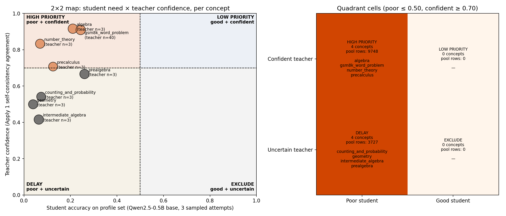
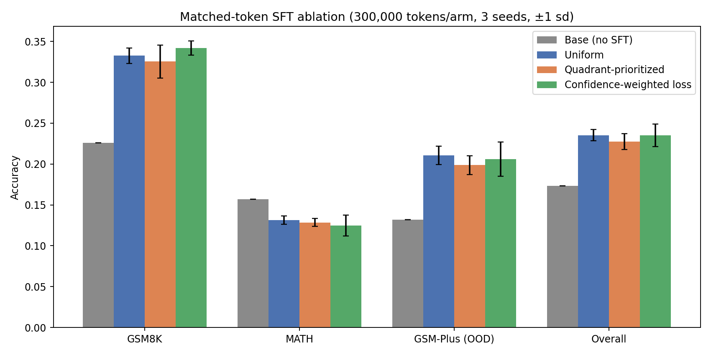
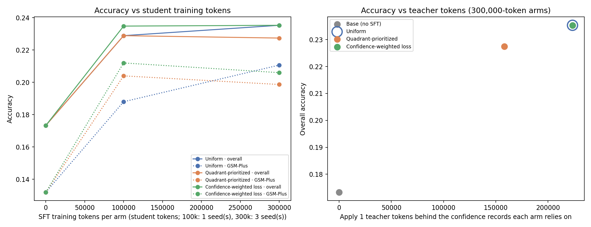

# Apply 2 results: student weakness profiling and 2×2 data selection

Run: 2026-10-02 19:00 – 2026-10-03 01:20 (UTC+08:00), branch `apply2-local-run`,
NVIDIA GeForce RTX 4060 Laptop GPU (8 GiB). Receipts, tables, and figures are
in [`results/apply2-rtx4060-20261003/`](../results/apply2-rtx4060-20261003/).
Operator: Claude Opus 5.5 (Claude Code).

## 1. Summary

**Question.** With the same number of student training tokens, does
supervised fine-tuning (SFT) on concepts where the student is weak and the
teacher is confident beat uniform SFT?

**Answer at this scale: no.** All three SFT arms clearly beat the untrained
student (about +5 to +6 points overall). Neither selective arm beat uniform
sampling. The quadrant-prioritized arm was 0.8 points lower overall, with a
95% interval of [−2.1, +0.5]. The confidence-weighted loss tied uniform
(0.0 points, [−1.0, +1.0]).

Main reasons the selection signal was weak (Section 6):

1. The 0.5B student is weak on every concept, so the "student need" axis did
   not separate concepts. Only teacher confidence decided the quadrant.
2. The teacher confidence for each MATH subject comes from only 3 Apply 1
   questions.
3. SFT targets are gold dataset solutions, which are always correct. Teacher
   reliability mainly matters when the teacher writes the training text.

## 2. Setup

| Item | Value |
| --- | --- |
| Student | `Qwen/Qwen2.5-0.5B` base. LoRA r=16, alpha 32, all linear projections; fp32 adapter on a bf16 base |
| Teacher signal | Apply 1 run `mini12h-rtx4060-20261001-230236` (`Qwen/Qwen2.5-Math-7B-Instruct`, 8 samples per question). Per concept: mean self-consistency agreement with the greedy answer. No new teacher calls |
| Training pool | GSM8K train + MATH train, minus a 10% per-concept profile holdout: 13,475 rows. GSM8K is one coarse concept; MATH uses its 7 subjects |
| Profile set | Up to 100 holdout questions per concept (726 total), 3 sampled attempts (T=0.7, top-p 0.95), 512 new tokens |
| Evaluation | Fixed seeded subsets: GSM8K test 500, MATH test 350 (50 per subject), GSM-Plus 500 (OOD, evaluation only). Greedy decoding, 512 new tokens |
| Training | lr 2e-4, AdamW, 4,096 supervised tokens per update, max length 1,024. Same settings for every arm |
| Budgets | 300k student tokens per arm × seeds 17, 18, 19; 100k tokens × seed 17. A planned 900k budget was dropped to save time |
| Statistics | Paired bootstrap over test questions (5,000 resamples, 95% intervals). Correctness is averaged over seeds per question before resampling |

Arms (each with exactly the same number of student training tokens):

- **Uniform:** a seeded random draw from the whole pool.
- **Quadrant-prioritized:** a draw from high-priority concepts only (poor
  student + confident teacher).
- **Confidence-weighted loss:** the same draw as Uniform, with each example's
  loss scaled by its concept's teacher confidence divided by the pool mean.

These map onto the proposal's main ablation: Standard = Uniform;
Confidence-gated ≈ Confidence-weighted (a soft gate); Student-aware +
confidence (Combined) = Quadrant-prioritized. A student-aware-only arm was
not run, because the student axis did not separate concepts (Section 3).

## 3. Student profile and the 2×2 map



| Concept | Student acc. | Entropy (nats) | Answer loss | Repeated failures | Teacher conf. (n) | Quadrant |
| --- | ---: | ---: | ---: | ---: | ---: | --- |
| gsm8k_word_problem | 0.243 | 0.56 | 0.84 | 47/100 | 0.909 (40) | high priority |
| algebra | 0.210 | 0.52 | 1.03 | 60/100 | 0.917 (3) | high priority |
| number_theory | 0.069 | 0.62 | 1.10 | 74/87 | 0.833 (3) | high priority |
| precalculus | 0.124 | 0.45 | 0.59 | 55/75 | 0.708 (3) | high priority |
| prealgebra | 0.260 | 0.58 | 1.09 | 54/100 | 0.667 (3) | delay |
| counting_and_probability | 0.074 | 0.70 | 1.27 | 64/77 | 0.542 (3) | delay |
| geometry | 0.038 | 0.62 | 1.12 | 80/87 | 0.500 (3) | delay |
| intermediate_algebra | 0.063 | 0.48 | 0.73 | 91/100 | 0.417 (3) | delay |

"Repeated failures" means wrong on all 3 attempts.

- With the predeclared thresholds (student ≤ 0.50 = poor, teacher ≥ 0.70 =
  confident), every concept is poor. The low-priority and exclude cells are
  empty. The high-priority pool has 9,748 rows and the delay pool 3,727.
- Precalculus (0.708) and prealgebra (0.667) sit close to the 0.70 teacher
  threshold. With n=3 teacher questions each, their side of the line is not
  reliable.
- Median-split sensitivity (relabeling only, no retraining;
  `report/threshold_sensitivity.csv`): with thresholds at the medians
  (student 0.10, teacher 0.69), all four cells fill. Only number theory stays
  high priority. GSM8K, algebra, and precalculus move to low priority,
  prealgebra to exclude. The quadrant arm's data would change almost entirely,
  so the arm is very sensitive to where the thresholds sit.

## 4. Ablation results



Accuracy in %. The 300k rows show mean ± sd over 3 seeds; the 100k rows are 1 seed.

| Budget | Arm | GSM8K | MATH | GSM-Plus (OOD) | Overall | Unique examples |
| --- | --- | ---: | ---: | ---: | ---: | ---: |
| — | Base (no SFT) | 22.6 | 15.7 | 13.2 | 17.3 | — |
| 100k | Uniform | 35.2 | 11.1 | 18.8 | 22.9 | 404 |
| 100k | Quadrant-prioritized | 32.2 | 13.1 | 20.4 | 22.9 | 501 |
| 100k | Confidence-weighted | 33.4 | 12.6 | 21.2 | 23.5 | 404 |
| 300k | Uniform | 33.3 ± 0.9 | 13.1 ± 0.5 | **21.1 ± 1.1** | **23.5 ± 0.7** | 1,244 |
| 300k | Quadrant-prioritized | 32.5 ± 2.0 | 12.9 ± 0.5 | 19.9 ± 1.1 | 22.7 ± 1.0 | 1,425 |
| 300k | Confidence-weighted | **34.2 ± 0.9** | 12.5 ± 1.3 | 20.6 ± 2.1 | **23.5 ± 1.4** | 1,244 |

Paired bootstrap differences (percentage points, 95% CI):

| Budget | Comparison | GSM8K | MATH | GSM-Plus | Overall |
| --- | --- | ---: | ---: | ---: | ---: |
| 300k | Quadrant − Uniform | −0.7 [−3.1, +1.7] | −0.3 [−2.2, +1.7] | −1.2 [−3.2, +0.8] | −0.8 [−2.1, +0.5] |
| 300k | Conf.-weighted − Uniform | +0.9 [−0.7, +2.7] | −0.7 [−2.2, +0.9] | −0.5 [−2.1, +1.3] | 0.0 [−1.0, +1.0] |
| 300k | Uniform − Base | +10.7 [+6.8, +14.5] | −2.6 [−6.0, +0.7] | +7.9 [+4.6, +11.1] | +6.2 [+4.0, +8.3] |
| 100k | Quadrant − Uniform | −3.0 [−7.0, +1.0] | +2.0 [−1.4, +5.4] | +1.6 [−1.8, +5.2] | 0.0 [−2.1, +2.2] |
| 100k | Conf.-weighted − Uniform | −1.8 [−4.8, +1.2] | +1.4 [−1.1, +4.0] | +2.4 [0.0, +5.0] | +0.6 [−1.0, +2.2] |

The full table, including each arm minus base, is in
`report/paired_bootstrap.csv`.

Per-concept accuracy at 300k (mean of 3 seeds; `report/per_concept_accuracy.csv`):

| Concept | Quadrant | n test | Base | Uniform | Quadrant | Conf.-weighted |
| --- | --- | ---: | ---: | ---: | ---: | ---: |
| gsm8k_word_problem | high | 500 | 22.6 | 33.3 | 32.5 | 34.2 |
| algebra | high | 50 | 30.0 | 26.0 | 21.3 | 25.3 |
| number_theory | high | 50 | 10.0 | 8.7 | 11.3 | 6.7 |
| precalculus | high | 50 | 8.0 | 6.7 | 7.3 | 6.7 |
| prealgebra | delay | 50 | 28.0 | 23.3 | 25.3 | 22.0 |
| counting_and_probability | delay | 50 | 8.0 | 10.0 | 6.7 | 10.0 |
| geometry | delay | 50 | 12.0 | 8.0 | 8.7 | 7.3 |
| intermediate_algebra | delay | 50 | 14.0 | 9.3 | 9.3 | 9.3 |

Observations:

- SFT helps GSM8K (about +10 to +12 points) and transfers to the GSM-Plus
  perturbations (+7 to +8). It slightly hurts MATH (−2.6 to −3.2; only the
  confidence-weighted interval excludes zero). Fine-tuned students still hit
  the 512-token cap on 21–28% of MATH answers (base: 29%), against 2–8% on
  GSM8K and GSM-Plus. Long MATH solutions remain hard for a 0.5B model to
  finish.
- Concentrating the budget on high-priority concepts did not raise accuracy
  on those concepts. It gave 1.4× as many GSM8K-heavy examples, yet GSM8K
  accuracy was no higher than uniform. Gains look saturated in the number of
  GSM8K examples at this budget.
- Per-subject MATH differences use 50 questions each, where one question is
  2 points. None of these differences are interpretable.
- Tripling the budget from 100k to 300k changed overall accuracy by less than
  1 point for every arm. Most of the gain comes from the first 100k tokens,
  which mostly teach answer format and stopping.

## 5. Token efficiency



- **Student tokens:** all arms reach 22.9–23.5% overall within 100k tokens
  and stay flat to 300k (100k is 1 seed).
- **Teacher tokens:** Apply 2 made no teacher calls. The x-axis counts the
  Apply 1 generated tokens behind the confidence records each arm relies on.
  Uniform and confidence-weighted use all 8 concept scores (223,511 tokens).
  Quadrant-prioritized draws data from the 4 high-priority concepts
  (158,318 tokens). However, it still needed all 8 scores to *choose* those
  concepts. Its 29% saving applies only if the teacher's cost scales with
  the data it supervises, not with the scoring itself.

## 6. Interpretation and limitations

- **The 2×2 collapsed to one column.** The proposal's "poor student +
  confident teacher" cell can only beat uniform if the map separates concepts
  on both axes. Here the student is weak everywhere, at 4–26% profile
  accuracy. A stronger student (Qwen2.5-1.5B or an instruct variant) or
  finer GSM8K concepts would be needed for the student axis to matter.
- **Teacher confidence is thin.** Each MATH subject's score comes from 3
  teacher questions, from test splits. Apply 1 was scoped to a 111-question
  exploratory run. More teacher scoring on train-split questions, per concept
  or per example, would make the map credible.
- **Gold-solution SFT hides teacher reliability.** The training text is
  always the dataset's own correct solution, so teacher confidence only
  steers *where* to train, not *whether the target is right*. Apply 1's
  mini-distillation, where the teacher wrote the targets, is where confidence
  gating can protect against bad targets.
- **Evaluation budget.** 50 MATH questions per subject and one 512-token cap.
  MATH accuracy is near the 0.5B student's floor.
- **Run conditions.** One student size, one learning rate, and one LoRA
  configuration; 3 seeds at 300k and 1 seed at 100k. Host RAM was about
  2 GiB free, so training time varied 3.5–28 minutes per arm. That affected
  runtime only, not results.
- **Pipeline fixes during this run** (DEVLOG, 2026-10-02): dedupe, stratified
  subsets, batched generation with a stop string, first-answer-marker
  scoring, and the fp32 adapter. They apply to every arm and the base model
  alike.

## 7. Suggested next steps

1. Score train-split questions with the teacher (per example, not per
   concept). Use `--teacher-scores` with `id` rows so the map and the
   weighting are per question.
2. Use Qwen2.5-1.5B (16+ GiB GPU) or Qwen2.5-0.5B-Instruct as the student,
   so that some concepts fall on the "good" side.
3. Add a student-aware-only arm (poor concepts regardless of teacher) to
   complete the proposal's four-way ablation.
4. Use teacher-generated targets for the selected examples, so that
   confidence affects target quality as well as data selection.

## 8. Reproduce

```powershell
python -m scripts.prepare_data
python -m scripts.make_subsets
python -m scripts.export_apply1_confidence --predictions <Apply 1 run>\predictions.jsonl
python -m scripts.profile_student --input data/processed/subsets/profile.jsonl --attempts 3 --max-new-tokens 512
python -m scripts.run_matrix --budgets 300000 --seeds 17 18 19
python -m scripts.run_matrix --budgets 100000 --seeds 17 --skip-base
python -m scripts.build_matrix_report
```
